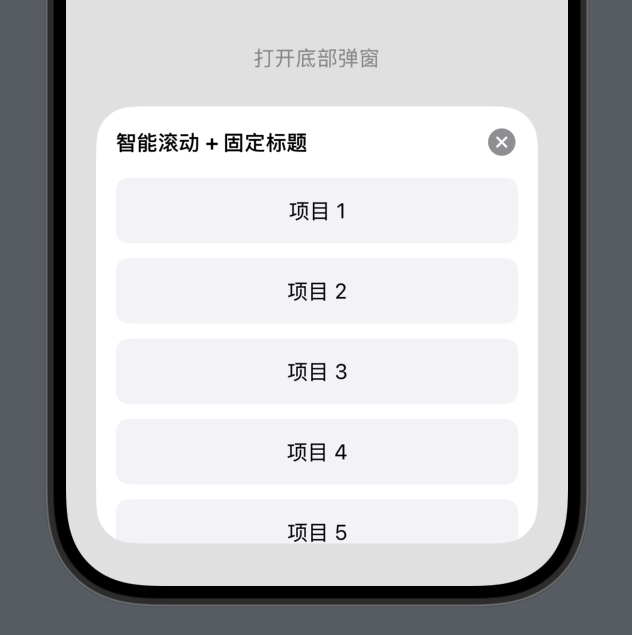

# BottomSheetKit
一个自定义样式的 SwiftUI 弹出卡片组件（Sheet），支持圆角、背景色、自定义内容插槽，自动滚动适配。



## ✨ 功能亮点

功能点 | 描述
- ✅ 一行集成 | 使用 MyCustomButton 即可轻松唤起底部弹窗
- ✅ 免写 @State | 内部自动处理弹窗控制，无需外部状态管理
- ✅ 支持默认按钮样式 | 快速使用文本按钮，无需额外配置
- ✅ 支持自定义按钮视图 | 可传入任意 SwiftUI 视图作为触发按钮，样式完全由你掌控
- ✅ 可配置弹窗内容 | 支持任意 SwiftUI 内容视图作为弹窗内容，支持滚动
- ✅ 参数灵活可调 | 自定义 title、detents、cornerRadius、background 等
- ✅ 系统风格原生弹窗 | 使用原生 .sheet + .presentationDetents + .presentationBackground
- ✅ iOS 17+ 兼容性好 | 自动适配 .presentationBackground，低版本不报错


## 📦 安装方式（Swift Package Manager）

在 Xcode 中选择：
File > Add Packages...


## 🚀 使用示例

```swift

import BottomSheetKit

//一行集成 
struct BottomSheetDemo: View {
    var body: some View {
        VStack {
            MyCustomButton(title: "操作选项", detents: [.height(300)]) {
                OptionListView()
            }
        }
    }
}
```

## 📐 API 说明

```swift
MyCustomButton(
    title: String,                    // 顶部标题文本
    detents: [.height(320)],          // sheet高度
    cornerRadius: CGFloat = 30,       // 圆角值，默认 30
    background: Color = .white,       // 弹窗背景色
)
```
## 🧩 使用场景

| 场景           | 描述               |
|----------------|--------------------|
| 设置页弹窗     | 修改头像、昵称等    |
| 选择器弹窗     | 城市、分类、主题选择 |
| 内容展示       | 通知列表、项目明细  |
